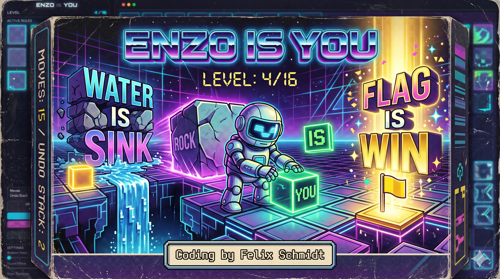

# 🐏 Enzo Is You - 3D Three.js WebGL Edition

An interactive, visually spectacular, high-end 3D recreation of the "Baba Is You" rule-merging puzzle game. Built using Three.js WebGL, modern atmospheric lighting, dynamically generated sound synthesis, and streamed remix audio. Fully responsive and runs natively in the browser.

### 🎮 [PLAY ONLINE NOW](https://enzocage.de/code/enzo_is_you)

---

## 📖 Table of Contents
1. [Core Concept & Rules](#-core-concept--rules)
2. [High-End WebGL Rendering Engine](#-high-end-webgl-rendering-engine)
3. [Lighting, Shading & Special Effects](#-lighting-shading--special-effects)
4. [Audio Synthesizer & Music Streamer](#-audio-synthesizer--music-streamer)
5. [The 20 Graphic Styles](#-the-20-graphic-styles)
6. [Interactive Level Editor](#-interactive-level-editor)
7. [Controls & Mobile Accessibility](#-controls--mobile-accessibility)
8. [File Structure & Technical Architecture](#-file-structure--technical-architecture)
9. [Local Installation & Execution](#-local-installation--execution)

---

## 🧠 Core Concept & Rules

In **Enzo Is You**, the rules of the game are present in the levels themselves as pushable blocks. By manipulating word blocks, you change how the game behaves:
- Push words to align sentences in grid-aligned horizontal or vertical chains.
- Sentences follow the syntax: **`[Subject/Noun] IS [Predicate/Property or Noun]`** (e.g., `ENZO IS YOU`, `WALL IS STOP`, `ROCK IS PUSH`).
- **Dynamic Transformations**: Rearranging rules can change entities instantly (e.g., aligning `ROCK IS ENZO` turns every boulder into a controllable player).

### Rule Properties Mapped:
- **`YOU`**: Gives you keyboard/touch controls over the entity.
- **`STOP`**: Makes the entity solid; players cannot walk through it.
- **`PUSH`**: Makes the entity pushable by `YOU` characters.
- **`WIN`**: Touching this entity triggers level completion.
- **`DEFEAT`**: Touching this entity destroys the `YOU` character.
- **`SINK`**: Any entity walking onto this is destroyed along with the sink entity (swallowed up).
- **`HOT`** & **`MELT`**: If a `MELT` entity touches a `HOT` entity, the `MELT` entity dissolves.
- **`OPEN`** & **`SHUT`**: If an `OPEN` key overlaps a `SHUT` door, both are destroyed, unlocking the passage.

---

## 🌐 High-End WebGL Rendering Engine

The visualization engine in [renderer.js](file:///c:/Users/enzoc/Desktop/AI%20Code/baba%20is%20you/renderer.js) has been fully rebuilt from traditional 2D Canvas to a **3D Three.js WebGL Engine**:
- **Crystalline Entities**: Game characters, text blocks, and objects are rendered as 3D geometric entities with dynamic scale wiggles and smooth position interpolation.
- **Starfield & Nebula Overlay**: The backdrop uses dynamic starfield particles and soft animated nebula clouds drifting slowly through depth space.
- **Atmospheric Fog**: Uses `THREE.FogExp2` to wash distant coordinate layers in deep purple, giving the grid a floating isometric look.
- **Elastic Animations**: Movements interpolate between positions using an elastic squashing/stretching animation to create a wobbly, organic aesthetic.

---

## 💡 Lighting, Shading & Special Effects

The WebGL scene features an advanced, multi-angle dynamic lighting setup:
- **Ambient Fill**: Indigo-purple fill lighting (`THREE.AmbientLight`) ensures shadows never look muddy and retain a vibrant ambient glow.
- **Vibrant Cyan Key Light**: A strong directional light casts soft, mapped shadows using `THREE.PCFSoftShadowMap` across all game structures.
- **Hot Pink Rim Light**: Casts specular edges along the 3D meshes, catching details during movements and animations.
- **Screen Shake & WebGL Particles**: Collision impacts and wins trigger camera shake and explode glowing WebGL particles into the viewport space.

---

## 🔊 Audio Synthesizer & Music Streamer

The sound system in [sound.js](file:///c:/Users/enzoc/Desktop/AI%20Code/baba%20is%20you/sound.js) integrates custom sound synthesis and audio streaming:
- **High-Fidelity Streamed Soundtrack**: Streams a retro-themed C64 Remix of *Lightforce* using the HTML5 `Audio` element, complete with loop functionality.
- **Procedural Sound Effects**: Collision bumps, movement chimes, rule creation fanfares, and turn rewinds are synthesized in real-time using low-frequency oscillators (LFO), gain envelopes, and delay nodes.
- **Master Slider Panels**: Sound effects and music volumes can be configured separately in the settings panel.

---

## 🎨 The 20 Graphic Styles

You can switch between **20 distinct graphic themes** in real-time, instantly transforming the visual look and particles:

### Original Styles
1. **Neon Cyberpunk (Default)**: Deep dark background, glowing neon outlines, neon round sparkles, grid line glows.
2. **Classic Retro Pixel**: Flat blocky retro shapes, thick 8-bit outlines, scrolling stars, and pixelated square particles.
3. **Chalkboard Sketch**: Chalkboard canvas, wobbly hand-drawn wobbly chalk lines, and drifting chalk dust particles.
4. **Blueprint Draughtsman**: Deep drafting paper, white technical design layout guidelines, coordinate markers.
5. **Monochrome GameBoy**: Retro olive-green palette (4 shades of green), pixelated grid LCD screen overlay, green square particles.
6. **Paper Cutout**: Pastel shaded cards, paper drop shadows on overlaps, drifting geometric confetti.
7. **Candy Land**: Fluffy cotton candy Enzo, chocolate bar walls, swirl lollipop flags, jelly water waves, molten strawberry lava.
8. **Matrix Digital Code**: Terminal black screen, cascading green katakana code rain. Sprites are drawn as green glowing characters.
9. **Minimalist Geometric**: Clean solid flat shapes with pastel high-contrast colors and no outlines.
10. **Aura Watercolor**: Textured white paper, soft blending watercolor blobs, ink droplet particles.

### Google Material Design 3 Styles
- Lavender, Mint, Coral, Sky, Lemon, Rose, Emerald, Clay, Charcoal (Dark), and Warm Sand.

---

## 🛠️ Interactive Level Editor

Design, test, and save your own levels with the built-in Sandbox suite:
- **Responsive Painting**: Tap/drag to paint blocks; right-click to erase them. Supports full touchscreen painting.
- **Custom Sizing**: Modify layout bounds in real-time (width and height up to 30x30).
- **Import/Export**: Copy or paste level codes in standardized JSON format.
- **LocalStorage Saves**: Save your creations directly to your browser's local sandbox, allowing you to reload them later.

---

## 🎮 Controls & Mobile Accessibility

### Keyboard Layout
- **Movement / Direction**: Arrow keys / `W`, `A`, `S`, `D`
- **Rewind Turn (Undo)**: `Z`
- **Reset Level**: `R`
- **Exit Playtest Sandbox**: `Escape`

*Note: Interaction with settings sliders automatically restores keyboard focus to the game viewport once you release the mouse, preventing control lockouts.*

### Mobile Gestures & Touch D-Pad
- **Gesture Swipes**: Swipe in any direction on the canvas to move.
- **Invisible Touch D-Pad**: Tap anywhere on the canvas; the game calculates the click angle relative to the center, mapping your tap to the corresponding movement quadrant.

---

## 📂 File Structure & Technical Architecture

The project has a modular, object-oriented design spanning 7 core files:
1. **[index.html](file:///c:/Users/enzoc/Desktop/AI%20Code/baba%20is%20you/index.html)**: High-end HTML layout incorporating sidebar settings, modals, canvases, and library links.
2. **[index.css](file:///c:/Users/enzoc/Desktop/AI%20Code/baba%20is%20you/index.css)**: Glassmorphic borders, custom range inputs, layout animations, and mobile drawer styles.
3. **[renderer.js](file:///c:/Users/enzoc/Desktop/AI%20Code/baba%20is%20you/renderer.js)**: 3D Three.js WebGL engine, particle systems, lights, meshes, and fog.
4. **[game.js](file:///c:/Users/enzoc/Desktop/AI%20Code/baba%20is%20you/game.js)**: Turn-taking logic, rule parsing algorithms, and interaction overlaps solver.
5. **[editor.js](file:///c:/Users/enzoc/Desktop/AI%20Code/baba%20is%20you/editor.js)**: Captures input brushes, updates editor grids, and loads custom local sandboxes.
6. **[levels.js](file:///c:/Users/enzoc/Desktop/AI%20Code/baba%20is%20you/levels.js)**: Hard-coded database storing level sizes, text strings, and categorized coordinates.
7. **[sound.js](file:///c:/Users/enzoc/Desktop/AI%20Code/baba%20is%20you/sound.js)**: Audio synthesizer logic and background MP3 streamer controls.

---

## 🚀 Local Installation & Execution

Since the project runs directly inside the browser using CDNs for external dependencies:
1. Clone or download the workspace directory.
2. Double-click **`index.html`** or host via a local dev server (e.g., `live-server`).
3. Open in a WebGL-compatible browser and play.
